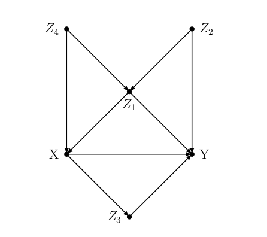

```{r,include=FALSE, eval=FALSE}

rm(list = ls())

#calling libraries
library(dplyr)
library(ggplot2)
library(stargazer)
library(kableExtra)
library(MatchIt)
library(magrittr)


set.seed(130)
```


### Task 1 - Another causal graph [5 points in total]

After months of deep thought, you decide that your thesis will focus on the relationship between X and Y. In preparation for the meeting with your supervisor, you read all the relevant literature, conduct interviews, and finally write down a directed acyclic graph that you believe captures all of the relevant variables, and their inter-relationships (see figure below). You proudly present the DAG below to your supervisor.



(a) For your DAG, write down all paths from X to Y. Which paths are causal? [2 pts]

<div style="color:blue">

Causal paths
X->Y
X->Z3->Y

Non causal Paths
X<-Z4->Z1<-Z2->Y
X<-Z1->Y
X<-Z4->Z1->Y
X<-Z1<-Z2->Y

</div>

(b) In the path {X ← Z4 → Z1 ← Z2 → Y , what type of node is Z1  Does conditioning on Z1 block or unblock this path from X to Y? Briefly explain your answer. [1 pt]

<div style="color:blue">

Z1 is a collider. Conditioning on z1 unblocks this path, creates endogenous bias and leads to a non-causal association.

</div>

(c) Now consider path {X ← Z1 → Y }. Does conditioning on Z1 block or unblock this path? Briefly explain your answer. [1 pt]

<div style="color:blue">

In this path Z1 is a confounder. Conditioning on Z1 will block this path because a confounder does not naturally block a path from X to Y.

</div>

(d) Based on your DAG, list the minimum conditioning sets that satisfy the back-door criterion for identifying the effect of X on Y. [1 pt]

<div style="color:blue">

Conditioning sets satisfying the backdoor criterion are

It is necessary to condition for Z1 to block the confounder effect on the path X ← Z1 → Y.

But doing so unblocks the collider effect it has on other non-causal paths. Thus, it is also necessary to block Z4 and Z2.

In this case, conditioning for Z1, Z2 and Z4 deems reasonable.

</div>

<br>
========================================================


### Task 2 - The consequences of child soldiering [12 points in total]

In this problem you will analyze the data in `child_soldiering.csv` from the Blattman and Annan (2010) article “The Consequences of Child Soldiering” (also in your assignment folder). The authors are interested in the impact of abduction by the Lord's Resistance Army on political, economic, and psychological outcomes; the data are from a survey of male youth in war-affected regions of Uganda. We will focus on the effect of abduction, which appears in the data as abd, on years of education, educ. Other variables in the data are:

- C.ach, C.akw, etc.: sub-district identifiers
- age: respondent’s age in years
- fthr.ed: father’s education (years)
- mthr.ed: mother’s education (years)
- orphan96: indicator for whether parents died before 1997
- fthr.frm: indicator for whether father is a farmer
- hh.size96: household size in 1996

(a) Use the difference-in-means estimator to estimate the NATE of abduction on education without adjusting for any of the covariates, and report your estimate along with a confidence interval. [2 pts]

```{r}
chi_so <- read.csv ("child_soldiering.csv")

```


```{r}
library(magrittr)
library(dplyr)
library(kableExtra)
chi_so %>% group_by(abd) %>%
  summarise(n_children = n(),
            mean_abduction = mean(educ),
            std_error = sd(educ) / sqrt(n_children)) %>% 
  round(3) %>% # rounding results
  kable() %>% # creating a kable table
  kable_styling() # viewing kable table


t.test(chi_so$educ ~ chi_so$abd)

```
Interpretation
From the results, our t-value is greater than two and the confidence interval range does not include zero. In this regard, not abducted children(abd=0) have a mean 7.416 years of schooling relative to abducted ones with a mean of 6.820 years of schooling.

NATE/Difference in means (Treatment minus control) = 6.820346-7.415771= -0.595425


(b) Check covariate balance in the unmatched dataset. Your output should be in the form of a balance table. Based on your table, which of the observed covariates seem to imply the strongest differences between those who were abducted and those who were not? [2 pts]

```{r}
chi_so %>%
  group_by(abd) %>%
  summarise_all(funs(mean(., na.rm = T))) %>% # summarizing the mean of every variable
  t() %>% # transposing data
  as.data.frame() %>% # after transposing, convert from matrix to df
  add_rownames("variable") %>% # rownames to explicit column
  rename(not_abducted = V1, abducted = V2) %>% # renaming columns that are created by as.data.frame
  mutate(difference = abducted - not_abducted,
         differencePerc = difference / (abducted + not_abducted)) %>% # creating new columns for difference between groups
  mutate_if(is.numeric, round, 3) %>% # rouning numeric columns
  kable() %>% # create kable table
  kable_styling() # view kable table
```

Interpretation

Covariates implying the strongest difference between those obducted and those not are the following
Covariates on districts: C.oro, C.akw, C.ata implying that abduction happened on certain districts of Northern Uganda and not on other districts say from south of Uganda.

(c) Now consider the authors’ description of abduction:

_Abduction was large-scale and seemingly indiscriminate; 60,000 to 80,000 youth are estimated to have been abducted and more than a quarter of males currently aged 14 to 30 in our study region were abducted for at least two weeks. Most were abducted after 1996 and from one of the Acholi districts of Gulu, Kitgum, and Pader._

_Youth were typically taken by roving groups of 10 to 20 rebels during night raids on rural homes. Adolescent males appear to have been the most pliable, reliable and effective forced recruits, and so were disproportionately targeted by the LRA. Youth under age 11 and over 24 tended to be avoided and had a high probability of immediate release._

Given this description and your what you found in (b), choose some covariates on which to perform an exact match, and then do so. Report an ATT estimate, i.e. an estimate of the average effect of abduction on education among those who were abducted. [2 pts]

The following are covariates I chose to perfom an exact match

fthr.ed: Because the more the father is educated, the welthier the family of a child is and this reduces the probability of being abducted.

age: Because based on empirics, children aged between 11 and 24 years had higher chances of being abducted.

orphan96: Because orphaned children have a higher chance of being abducted compared to ones with parents.

fthr.frm: Because children whose fathers are farmers are relatively poor and have a high chance of being abducted 

mthr.ed: Because children whose mothers education in years is higher than the rest are less likely to be abducted because they are richer compared to the rest.

```{r}
library(MatchIt)
#omitting missing values
names(chi_so)
match_so <- chi_so %>% 
  select(abd, educ, fthr.ed, mthr.ed, age, 
         orphan96, fthr.frm) %>% 
  na.omit()

#performing and exact match
exact_match <- matchit(abd ~ fthr.ed + mthr.ed + age +
                         orphan96 + fthr.frm, 
                       method = "exact", 
                       data = match_so)

#grabbing the matched data
data_exact_match <- match.data(exact_match)

#estimating t test
t.test(data_exact_match$educ ~ data_exact_match$abd)
```
Interpretation

From the results, we observe that the ATT (Treatment minus control) =6.593333-7.170732= -0.577399. It is not quite different from the NATE.

(d) Next, specify a logit model to generate the propensity scores, show the output of the model, and provide a plot that compares the distribution of the propensity scores for the treated and untreated units (before matching). [3 pts]

```{r, results='asis'}
library(stargazer)
#estimating my logit model
logit <- glm(abd ~ fthr.ed + mthr.ed + age +
                         orphan96 + fthr.frm,
            family = binomial(), 
            data = chi_so)

#viewing the output
stargazer(logit, type = "html")
```

Extracting predicted probabilities of the knitted model
```{r}
library(ggplot2)
prd_prob <- data.frame(pr_score = predict(logit, type = "response"),
                     abd = logit$model$abd)

#plotting propensity scores
prd_prob %>%
  ggplot(aes(x = pr_score, fill = factor(abd))) +
  geom_density(alpha = 0.5) +
  labs(x = "Propensity Score Distribution: Treatment and Control Groups",
       fill = "Education Level on abduction")
```

We see that the density for the treatment group, abducted children is slightly higher. Also that there is a very small variation of the scores where the plot starts as opposed to how it would be if we did not do a matching test.

(e) Now, apply nearest neighbor matching with a 1:1 ratio and replacement on the propensity scores to estimate the ATT and plot the densities of the propensity scores for the treated and untreated units. Assess balance using a table, as before. [3 pts]

```{r}
one_on_one <- matchit(abd ~ fthr.ed + mthr.ed + age +
                         orphan96 + fthr.frm,
                     method = "nearest", 
                     ratio = 1, 
                     replace = TRUE,
                     data = match_so)

summary(one_on_one)
```
Plotting
```{r}
plot(one_on_one, type = "hist")
```

Assessing balance
```{r}
# getting dataset
prop_match <- match.data(one_on_one)

# check balance
prop_match %>%
  group_by(abd) %>%
  summarise_all(funs(mean)) %>%
  t() %>% 
  as.data.frame() %>% 
  add_rownames("variable") %>% 
  rename(not_abducted = V1, abducted = V2) %>% 
  mutate(difference = abducted - not_abducted,
         differencePerc = difference / (abducted + not_abducted)) %>% 
  mutate_if(is.numeric, round, 3) %>% 
  kable() %>% 
  kable_styling()
```

From the table, we observe covariates with a significant difference being
educ: a child's education
mthr.ed: years of a mother's education.
orphan96: orphaned children

```{r, results='asis'}
logit_2 <- glm(abd ~ educ + fthr.ed + mthr.ed + age +
                         orphan96 + fthr.frm,
            family = binomial(), 
            data = chi_so)

stargazer(logit_2, type = "html")
```

```{r}
prd_prob_2 <- data.frame(pr_score = predict(logit_2, type = "response"),
                     abd = logit_2$model$abd)

#plotting propensity scores
prd_prob_2 %>%
  ggplot(aes(x = pr_score, fill = factor(abd))) +
  geom_density(alpha = 0.5) +
  labs(x = "Propensity Score Distribution: Treatment and Control Groups",
       fill = "Education Level on abduction")

```

With the non-exact match, we see that the density for the control group (children not abducted) is higher compared to the abducted ones. Also that there is a very small variation of the scores where the plot starts as opposed to how it would be if we did not do a matching test.